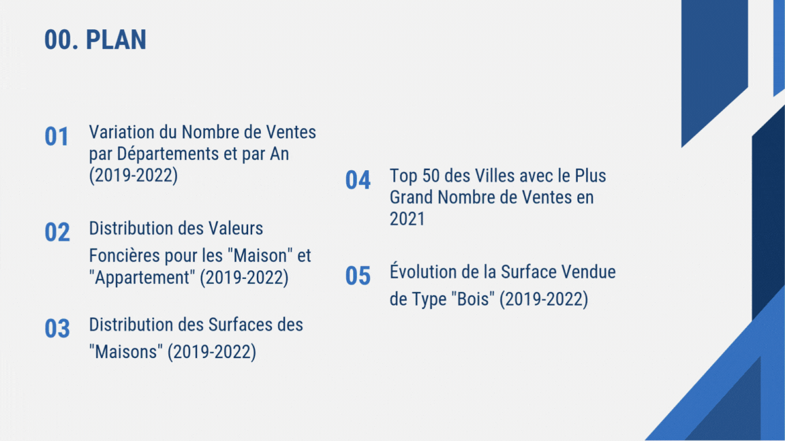

# Real Estate Analysis in France (2019-2022)

Below is a presentation summarizing the key findings and methodologies used.

## Table of Contents
1. [Introduction](#introduction)
2. [Dataset](#dataset)
3. [Analysis](#analysis)
4. [Methods](#methods)
5. [Results](#results)
6. [Technologies Used](#technologies-used)
7. [How to Run](#how-to-run)
8. [Challenges and Solutions](#challenges-and-solutions)
9. [Future Work](#future-work)

## Introduction
This project analyzes real estate transaction trends in France from 2019 to 2022 using the "Demande de Valeurs Foncières" (DVF) dataset. The goal is to explore variations in sales by departments, property value distributions for houses and apartments, house surface area distributions, and identify the top cities by sales volume in 2021.

## Dataset
The DVF dataset provides real estate transaction data in France, including details such as department, city, property type, value, surface area, and transaction date. For this analysis, we use the data from 2019 to 2022, which is publicly available from [the French government's open data portal](https://www.data.gouv.fr/fr/datasets/demandes-de-valeurs-foncieres/).

## Analysis
The analysis includes:
- Variation in the number of sales by departments and years.
- Distribution of property values for houses and apartments over time.
- Distribution of house surface areas by departments and years.
- Identification of the top 50 cities with the highest number of sales in 2021.

## Methods
- **Data Processing**: Used PySpark to handle large datasets, performing SQL queries for aggregation and filtering.
- **Visualization**: Employed Matplotlib and Seaborn to create box plots, line plots, and other visualizations to illustrate trends and distributions.

## Results
- **Sales by Departments**: Total sales across all years: 16,426,333. Peak sales in 2021 with 4,663,026 transactions.
- **Property Values**: Average values for apartments increased from 1,807,423 EUR in 2020 to 8,374,294 EUR in 2022. For houses, averages ranged from 352,241 EUR in 2020 to 824,650 EUR in 2021.
- **House Surface Areas**: Largest total surface areas in department 59 (Nord), with 3,449,391 m² in 2021.
- **Top Cities in 2021**: Toulouse led with 32,440 sales, followed by Nice (23,042), Besançon (20,395), and Montpellier (19,107).

## Technologies Used
- Python
- PySpark
- Matplotlib
- Seaborn
- Jupyter Notebook

## How to Run
This notebook is best run on Google Colab due to its ease of setup with Spark. Here's how:

1. Open the notebook in Google Colab.
2. Install PySpark if not already installed: `!pip install pyspark`.
3. Ensure that the data is accessible; you may need to mount Google Drive or upload the data to Colab.

For local setup:

1. Install Python and Jupyter.
2. Install required libraries: `pip install -r requirements.txt`.
3. Install Java, as Spark requires it.
4. Set up Spark by following the official installation guide for your operating system.
5. Download the DVF dataset and adjust the data paths in the notebook.

Given the complexity of local Spark setup, running on Google Colab is recommended.

## Challenges and Solutions
- Handling large datasets: Used PySpark to efficiently process the data.
- Data cleaning: Converted "Valeur fonciere" column by replacing commas with dots for numerical processing.

## Future Work
- Expand analysis to include more years or additional property types.
- Incorporate machine learning models to predict property values based on features.
- Develop interactive dashboards for exploring the data.
